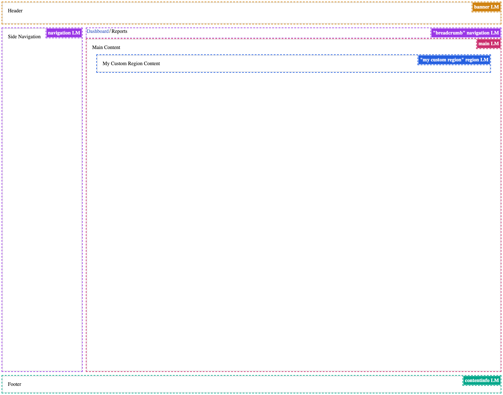

# React Accessible Dashboard Example

This project demonstrates how to build a **fully accessible dashboard layout** in React using **landmarks** and **custom regions**. The goal is to create reusable components that improve navigation, screen-reader usability, and semantic structure for your app.

---

## Features

- **Reusable Landmark Components**
  - `Header`, `Sidebar`, `MainContent`, `Footer`, and `Breadcrumbs`
  - Custom `Region` component for non-standard sections
- **Accessibility Focused**
  - Proper use of semantic HTML and ARIA roles
  - Screen-reader friendly navigation
- **Flexible Layout**
  - Built with CSS Grid (or Flexbox alternative)
  - Sidebar, main content, and utility panels aligned and responsive

---

## Project Structure

The project is organized to keep **components reusable** and layouts separate from pages:

```plaintext
src/
├─ components/
│  ├─ Header
|  ├───index.tsx
│  ├─ Sidebar
|  ├───index.tsx
│  ├─ Main
|  ├───index.tsx
│  ├─ Breadcrumbs
|  ├───index.tsx
│  ├─ Footer
|  ├───index.tsx
│  └─ Region
|  ├───index.tsx
├─ layouts/
│  └─ Dashboard.tsx
├─ pages/
│  └─ Dashboard.tsx
└─ App.tsx
```

- **components/**: Individual reusable landmark and custom region components
- **layouts/**: Dashboard layout that assembles the components into a complete page
- **pages/**: Example page showing usage of the layout

---

## Getting Started

Follow these steps to set up and run the project locally.

### 1. Install Dependencies

Use npm or yarn to install the project dependencies:

```bash
npm install
```

### 2. Run the Application

```bash
npm run dev
```

## Usage Example

```
import DashboardLayout from './layouts/DashboardLayout';

const breadcrumbItems = [
  { label: 'Dashboard', href: '/dashboard' },
  { label: 'Reports', isCurrent: true },
];

function DashboardPage() {
  return (
    <DashboardLayout breadcrumbItems={breadcrumbItems}>
      <p>Welcome to your accessible dashboard!</p>
    </DashboardLayout>
  );
}

export default DashboardPage;
```

## Accessibility Insight

The screenshot below shows how the dashboard layout is recognized by the **Accessibility Insights** extension. All landmarks, including the custom `Region` component, are correctly identified, making navigation clear for screen-reader users.


